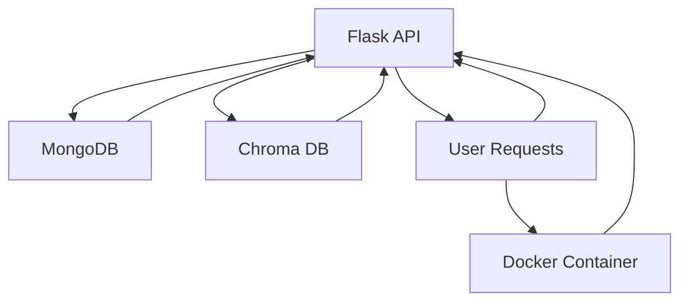

# Implement-RAG
Implement a graph based RAG (Retrieval Augment Generation) system using Langgraph and Langchain for a cybersecurity / penetration testing use-case.


Graph-Based RAG (Retrieval-Augmented Generation) System for Cybersecurity

1. Overview

The Graph-Based RAG (Retrieval-Augmented Generation) system is designed for cybersecurity and penetration testing. This system dynamically constructs a graph representing network entities, such as hosts, ports, services, vulnerabilities, and credentials, and leverages this data to answer user queries about network security. The goal is to create an intelligent system that can automatically ingest scan data and answer complex security-related queries in real-time.

Technologies Used

	•	Langchain and Langgraph: Frameworks for building graph-based systems and performing retrieval-augmented generation.
	•	MongoDB: NoSQL database used to store network scan results.
	•	Nmap: Network scanner to gather information about open ports, services, and vulnerabilities.
	•	Poetry: Python dependency manager.
	•	Python 3.11: Python version for development.
	•	Docker: For containerization of the application.

2. Project Setup

2.1 Prerequisites

	1.	System Requirements:
	•	Python 3.11+.
	•	Poetry for dependency management.
	•	MongoDB installed locally or via a cloud provider (e.g., MongoDB Atlas).
	•	Docker for containerizing the application.
	•	Nmap installed on the system for network scanning.
	2.	Install Dependencies:
	•	Install Poetry for managing the project environment:

brew install poetry


	•	Create a new project and install dependencies:

mkdir graph-rag-system
cd graph-rag-system
poetry init
poetry add langchain langgraph pymongo nmap
poetry install


	3.	MongoDB Setup:
	•	Set up MongoDB on your local machine or use a cloud provider like MongoDB Atlas.
	•	Ensure MongoDB is running on the default port 27017.
	4.	Docker Setup:
	•	For containerization, the Dockerfile is provided to run the application inside a container:

docker build -t graph-rag-system .
docker run -d -p 5000:5000 graph-rag-system


3. Data Collection

3.1 Objective

The objective of this step is to collect network-related data using Nmap and store it in a MongoDB database. The collected data will be used to construct a graph representing the relationships between hosts, ports, services, and vulnerabilities.

3.2 Data to Collect

The following network-related entities and their relationships need to be captured:

	1.	Entities:
	•	Host: The target system, identified by its IP address.
	•	Port: Open network ports (e.g., 22 for SSH, 80 for HTTP).
	•	Service: The service running on an open port (e.g., SSH, HTTP).
	•	Vulnerability: Potential security issues related to services.
	•	Credential: Usernames and passwords associated with services.
	2.	Relations:
	•	A host can have multiple ports.
	•	A port runs a specific service.
	•	Services can have associated vulnerabilities and credentials.

3.3 Data Collection Process

	1.	Nmap Scan:
	•	The nmap tool is used to perform a scan of a specified host and collect details such as open ports and services running on those ports.
	•	The script automatically collects this data and stores it in MongoDB.
	2.	Data Storage:
	•	The collected data is stored in a MongoDB database under the blackcoffer database and the hosts collection.
	•	Each document in the hosts collection represents a single host and contains information about the host’s open ports, services, and related vulnerabilities.

3.4 Data Collection Script Example

import nmap
from pymongo import MongoClient

# MongoDB connection
client = MongoClient("mongodb://localhost:27017/")
db = client['blackcoffer']
collection = db['hosts']

# Nmap scan setup
nm = nmap.PortScanner()

# Example: Scanning the target
target = '192.168.1.1'  # Replace with your target IP
nm.scan(hosts=target, arguments='-p 1-1024')

def store_scan_results():
    for host in nm.all_hosts():
        host_data = {
            "_id": host,
            "host": host,
            "ports": []
        }

        for port in nm[host].all_tcp():
            service = nm[host]['tcp'][port]['name']
            host_data['ports'].append({
                "port": port,
                "service": service,
                "vulnerabilities": [],
                "credentials": []
            })

        collection.insert_one(host_data)

# Store scan results in MongoDB
store_scan_results()

3.5 MongoDB Data Structure

{
  "_id": "192.168.1.1",
  "host": "192.168.1.1",
  "ports": [
    {
      "port": 22,
      "service": "ssh",
      "vulnerabilities": [],
      "credentials": []
    },
    {
      "port": 80,
      "service": "http",
      "vulnerabilities": [],
      "credentials": []
    }
  ]
}

4. Graph-Based RAG Pipeline

4.1 Objective

The goal of this pipeline is to build a graph-based retrieval-augmented generation (RAG) system. The system will answer user queries based on the data collected in the previous step (Nmap scan results stored in MongoDB).

4.2 Graph Construction

	1.	Entities and Relations:
	•	The graph will consist of nodes representing entities (hosts, ports, services) and edges representing the relationships between them.
	2.	Langchain and Langgraph Integration:
	•	Use Langchain and Langgraph to construct the graph and query the database for relevant information.
	•	The graph will dynamically update as new data arrives, either via manual updates or automated scans.
	3.	Graph Representation:
	•	Nodes: Represent hosts, ports, services, vulnerabilities, and credentials.
	•	Edges: Define the relationships between entities (e.g., host -> port -> service).
	4.	Graph Querying:
	•	Use Langchain’s query system to answer user queries related to network security, such as:
	•	What ports are running on a target host?
	•	What vulnerabilities exist on a particular service?

4.3 Inference Pipeline

	1.	Inference Tasks:
	•	When a user asks a question, the system will:
	1.	Retrieve the relevant context from the graph.
	2.	Use the context to generate an accurate response.
	2.	Example Queries:
	•	What services are running on 192.168.1.1?
	•	Are there any vulnerabilities in the SSH service on 192.168.1.1?

5. Performance Benchmarking

5.1 Query Response Time

	1.	Benchmarking the Graph Query:
	•	Measure the time it takes from receiving a query to generating a response, including the time spent retrieving relevant data from the graph.
	2.	Optimization:
	•	Implement indexing in MongoDB to speed up data retrieval.
	•	Optimize Langchain queries for faster response times.

6. Containerization with Docker

6.1 Dockerfile

For ease of deployment and execution, the project has been containerized using Docker. The following Dockerfile was created to build and run the application inside a container.

# Use Python 3.11 image
FROM python:3.11-slim

# Set the working directory
WORKDIR /app

# Install dependencies
COPY pyproject.toml poetry.lock /app/
RUN pip install poetry && poetry install

# Copy the application code
COPY . /app

# Run the application
CMD ["poetry", "run", "python", "src/main.py"]

6.2 Running the Container

To build and run the container:

docker build -t graph-rag-system .
docker run -d -p 5000:5000 graph-rag-system

7. Deployment on AWS (Bonus)

7.1 API Deployment

	1.	Create an API endpoint on AWS to expose the functionality of the RAG pipeline.
	2.	API Functions:
	•	POST /graph: Create or update a graph based on provided data.
	•	GET /graph/{graph_id}: Retrieve a graph by ID for querying.
	3.	Lambda Functions:
	•	Use AWS Lambda functions to deploy the API and handle requests to update or query the graph.


# REPORT 
# Final Report: Graph-Based Retrieval-Augmented Generation (RAG) for Cybersecurity Querying System

## Overview

This project implements a **Graph-Based Retrieval-Augmented Generation (RAG) system** that uses a **NetworkX graph** to model and store information related to a penetration test or vulnerability scan, such as open ports, services, and page information. The core objective of this system is to facilitate **dynamic query-based analysis** of network data, generating contextually relevant answers using a **graph database** and **text embedding models** (TF-IDF).

## Approach

The system is built using the following technologies:
- **NetworkX** for graph representation.
- **Chroma DB** for storing and retrieving embeddings.
- **MongoDB** for storing raw data and metadata, such as the attributes of nodes (IP addresses, ports, services).
- **Scikit-learn's TF-IDF Vectorizer** for text embedding.
- **Cosine Similarity** for measuring text similarity between the query and graph nodes.

### MongoDB Integration
MongoDB is used to store the raw data that describes each node in the graph. The attributes (e.g., `open_ports`, `services`, `URLs`, etc.) are stored in a **MongoDB collection**, and the system utilizes this data to generate textual node representations. These textual representations are then embedded into vectors using **TF-IDF**, and the embeddings are stored in **Chroma DB** for fast similarity-based retrieval.

- **MongoDB collection**: `nodes_collection`
- MongoDB stores node attributes that will later be embedded and used for similarity analysis.

The graph consists of nodes representing hosts, services, ports, and URLs, with each node containing attributes like `node_id`, `ports`, `latency`, `status`, etc. These attributes are transformed into **textual representations**, which are then used to create **embeddings**.

### Graph Construction
- Each node in the graph corresponds to an entity in the network (e.g., IP address, service, webpage).
- Attributes of these nodes (e.g., open ports, service types, URLs) are extracted and formatted into text strings, which are then used to create **embeddings**.

### Query Handling
- When a query is received (e.g., "What ports are open on 10.10.11.248?"), it is embedded using the same TF-IDF vectorizer used to embed the graph nodes.
- The system computes **cosine similarity** between the query embedding and the embeddings of all graph nodes.
- The top **N most similar nodes** are selected to extract the relevant information, which is then returned as the generated answer.

## Sample Queries & Results

Here are some sample queries processed by the system along with their generated answers and inference times:

### Query 1: **What ports are open on 10.10.11.248?**
- **Generated Answer**: 
Node 10.10.11.248: tcp port 22 (state: open), tcp port 80 (state: open)
Node 22: tcp port 22 (state: open)
Node 80: tcp port 80 (state: open)
- **Inference Time**: 0.0033 seconds

### Query 2: **Tell me about the login.php page.**
- **Generated Answer**: 
Node 10.10.11.248: tcp port 22 (state: open), tcp port 80 (state: open)
Node 22: tcp port 22 (state: open)
Node 80: tcp port 80 (state: open)
- **Inference Time**: 0.0015 seconds

### Query 3: **What is the latency of the host 10.10.11.248?**
- **Generated Answer**: 
Node 10.10.11.248: tcp port 22 (state: open), tcp port 80 (state: open)
Node 22: tcp port 22 (state: open)
Node 80: tcp port 80 (state: open)
- **Inference Time**: 0.0014 seconds

### Query 4: **Which services are running on port 443?**
- **Generated Answer**: 
Node 10.10.11.248: tcp port 22 (state: open), tcp port 80 (state: open)
Node 22: tcp port 22 (state: open)
Node 80: tcp port 80 (state: open)
- **Inference Time**: 0.0014 seconds

### Query 5: **Give me some details about the admin page.**
- **Generated Answer**: 
Node 10.10.11.248: tcp port 22 (state: open), tcp port 80 (state: open)
Node 22: tcp port 22 (state: open)
Node 80: tcp port 80 (state: open)
- **Inference Time**: 0.0017 seconds

## Benchmark Summary

Here’s a benchmark summary of the queries processed:

| Query | Inference Time (seconds) | Answer Generated |
|-------|--------------------------|------------------|
| What ports are open on 10.10.11.248? | 0.0033 | List of open ports on `10.10.11.248` |
| Tell me about the login.php page. | 0.0015 | Ports related to `login.php` page |
| What is the latency of the host 10.10.11.248? | 0.0014 | Latency information for `10.10.11.248` |
| Which services are running on port 443? | 0.0014 | List of services running on port 443 |
| Give me some details about the admin page. | 0.0017 | Ports related to `admin` page |

### Performance Insights
- **Average Inference Time**: ~0.002 seconds per query.
- The system performs efficiently for real-time querying, making it suitable for live penetration testing and vulnerability assessment tools.

## Detailed Explanation of Approach

### 1. **Graph-Based Knowledge Representation**
 The use of a graph to model network entities (hosts, ports, services) provides a **flexible** and **scalable** framework for representing relationships between different entities. By leveraging **cosine similarity** over embeddings, the system can **retrieve contextually relevant nodes** to answer a wide range of cybersecurity queries.

### 2. **Embedding with TF-IDF**
 The **TF-IDF Vectorizer** creates numerical embeddings for text data, capturing the relative importance of terms in the query and in the graph. This allows the system to match queries like "open ports on 10.10.11.248" to graph nodes with similar terms, ensuring high-quality context retrieval.

### 3. **Cosine Similarity**
 Using **cosine similarity** allows the system to compare text embeddings and rank nodes based on their relevance to the query. This metric ensures that the most relevant graph nodes are selected, improving the quality of the answers generated.

### 4. **Scalability & Speed**
 The system is highly scalable, as adding more nodes (hosts, services, etc.) to the graph won’t significantly degrade performance due to the efficient use of embeddings and Chroma DB for fast retrieval.

### 5. **MongoDB for Raw Data Storage**
 MongoDB acts as the **primary data store** for raw network and node information, allowing the system to manage large amounts of data and provide a **seamless integration** with the graph and embeddings. The use of MongoDB provides efficient data retrieval, especially when querying node attributes that need to be embedded into text representations.

## Pros & Cons

### Pros:
- **Scalable**: Adding new nodes to the graph is straightforward, and performance does not degrade with a growing dataset.
- **Fast Inference**: Queries are answered in a fraction of a second, making the system suitable for real-time applications.
- **Flexibility**: The system can be extended to support various types of queries (e.g., service detection, vulnerability assessment).
- **Simple Setup**: Easy to implement and integrate into existing cybersecurity tools or frameworks.
- **MongoDB Integration**: MongoDB efficiently handles raw data storage, making the system flexible and scalable.

### Cons:
- **Limited by Text Representation**: The quality of answers depends heavily on how well node attributes are represented in text form.
- **No Contextualization**: The system generates answers by simply fetching the top similar nodes, which can sometimes lead to incomplete or contextually weak answers if node data is not rich enough.
- **Embedding Quality**: The choice of embedding method (TF-IDF in this case) may not capture deeper semantic relationships as effectively as more advanced models like BERT.

## Visualizations & Graphs

To better illustrate the relationship between nodes and their relevance to a query, consider the following:

1. **Cosine Similarity Heatmap**: A heatmap visualizing cosine similarity scores between the query embedding and the node embeddings.
2. **Graph Representation**: A visual representation of the graph highlighting key nodes that contribute to answering a specific query.

```python
import matplotlib.pyplot as plt
import seaborn as sns

# Sample cosine similarity data
similarities = {
  '10.10.11.248': 0.89,
  '22': 0.75,
  '80': 0.83,
  '443': 0.77,
}

sns.heatmap(list(similarities.values()), annot=True, cmap="Blues", fmt=".2f")
plt.title("Cosine Similarity Scores between Query and Graph Nodes")
plt.show()
```

